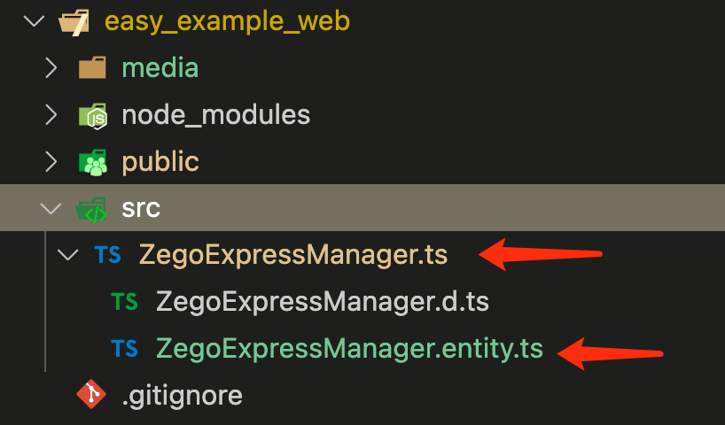
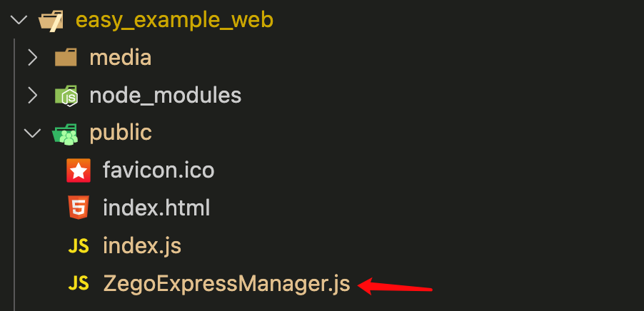

# ZEGOCLOUD easy example

ZEGOCLOUD's easy example is a simple wrapper around our RTC product. You can refer to the sample code for quick integration.This branch is an invitation call scenario, including offline push；

## Getting started

The following will describe how to start this project.

### Prerequisites

* Create a project in [ZEGOCLOUD Admin Console](https://console.zegocloud.com/). For details, see [ZEGO Admin Console - Project management](https://docs.zegocloud.com/article/1271).
* Create in firebase to create a project, [see more details ](https://firebase.google.com/docs/web/setup#config-object)
* Prepare your own server, we provide a heroku template to quickly help you deploy, [click to view details](https://github.com/ZEGOCLOUD/easy_example_call_server_nodejs)

### Install

1. Clone the easy example Github repository.
2. Open Terminal, navigate to the `easy_example_web` folder.
3. Run the `npm install` command to install all dependencies that are needed.

### Modify the project configurations


* You need to modify `appID` and `serverURL` to your own account, which can be obtained in the [ZEGO Admin Console](https://console.zegocloud.com/).
* [Generate a Token on your app server (recommended)](), provide an interface for the client to call and replace the generateToken method above.

### Run the sample code

Start the project locally with the following command.

```ssh
# Start a local service
npm run dev
```

## Integrate the SDK into your own project

The following will describe how to build your own project based on this project.

### Copy the source code

Copy the `ZegoExpressManager.ts` and `ZegoExpressManager.entity.ts` files to your typescript project.



If your project is implemented in JavaScript, you need to execute the package command first and then copy the ZegoExpressManager.js file to the project.

```ssh
# Packaging ZegoExpressManager
npm run build:dev

# Package ZegoExpressManager and compress the code
npm run build
```



### Method call

The calling sequence of the SDK interface is as follows:
createEngine --> onRoomUserUpdate、onRoomUserDeviceUpdate、onRoomTokenWillExpire --> checkWebRTC --> checkCamera --> checkMicrophone --> joinRoom --> getLocalVideoView/getRemoteVideoView --> leaveRoom

#### Create engine

Before using the SDK function, you need to create the SDK first. We recommend creating it when the application starts. The sample code is as follows:

```typescript
ZegoExpressManager.shared.createEngine(config.appID, config.serverURL);
```

#### Register related callbacks

You can get information in the relevant callbacks and do your own thing.

```typescript
ZegoExpressManager.shared.onRoomUserUpdate((roomID, updateType, userList) => {
    // Do something...
});
ZegoExpressManager.shared.onRoomUserDeviceUpdate((updateType, userID, roomID) => {
    // Do something...
});
ZegoExpressManager.shared.onRoomTokenWillExpire((roomID) => {
    // Do something...
});
```

#### Check webRTC

Check browser compatibility with WebRTC.

```typescript
ZegoExpressManager.shared.checkWebRTC();
```

#### Check camera

Check whether the camera has permission to call.

```typescript
ZegoExpressManager.shared.checkCamera();
```

#### Check microphone

Check whether the microphone has permission to call.

```typescript
ZegoExpressManager.shared.checkMicrophone();
```

#### Join room

When you want to communicate with audio and video, you need to call the join room interface first. According to your business scenario, you can set different audio and video controls through options, such as:

ZegoMediaOptions enumeration can be found in src/ZegoExpressManager.entity.ts.

1. call scene: [ZegoMediaOptions.AutoPlayVideo, ZegoMediaOptions.AutoPlayAudio, ZegoMediaOptions.PublishLocalAudio, ZegoMediaOptions.PublishLocalVideo], the default is this scenario
2. Live scene - host: [ZegoMediaOptions.AutoPlayVideo, ZegoMediaOptions.AutoPlayAudio, ZegoMediaOptions.PublishLocalAudio, ZegoMediaOptions.PublishLocalVideo]
3. Live scene - audience:[ZegoMediaOptions.AutoPlayVideo, ZegoMediaOptions.AutoPlayAudio]
4. Chat room - host: [ZegoMediaOptions.AutoPlayAudio, ZegoMediaOptions.PublishLocalAudio]
5. Chat room - audience: [ZegoMediaOptions.AutoPlayAudio]

The following sample code is an example of a call scenario, options can not be passed by default:

```typescript
ZegoExpressManager.shared.joinRoom(config.roomID, token, { userID: config.userID, userName: config.userName });
```

#### Get video view

If your project needs to use the video communication function, you need to get the View for displaying the video, call `getLocalVideoView` for the local video, and call `getRemoteVideoView` for the remote video.

**getLocalVideoView:**

```html
<div id="video-con1"></div>
```

```typescript
const renderView1 = document.querySelector('#video-con1');
const videoDom = ZegoExpressManager.shared.getLocalVideoView();
renderView1.appendChild(videoDom);
```

**getRemoteVideoView:**

```html
<div id="video-con2"></div>
```

```typescript
const renderView2 = document.querySelector('#video-con2');
ZegoExpressManager.shared.onRoomUserUpdate((roomID, updateType, userList) => {
    userList.forEach(userID => {
        if (updateType === 'ADD') {
            const videoDom = ZegoExpressManager.shared.getRemoteVideoView(userID);
            renderView2.appendChild(videoDom);
        }
    });
});
```

#### Leave room

When you want to leave the room, you can call the leaveroom interface.

```typescript
ZegoExpressManager.shared.leaveRoom();
```

## Change Log

### 2022-05-09

#### Code Optimization

1. Replace the original getLocalVideoView and setRemoteVideoView with getLocalVideoView and getRemoteVideoView. Automatically create video tag in ZegoExpressManager.
2. Destroy the local stream when leaving the room.
3. Replace server with serverURL to align the console.

#### Bug Fixes

1. Empty the local video view container when exiting the room.
2. Clear the remote video view container when other members exit the room.
3. Adapt the options parameter of the flutter platform to the joinRoom interface.
4. Increase the judgment of whether it is empty for renderView.
